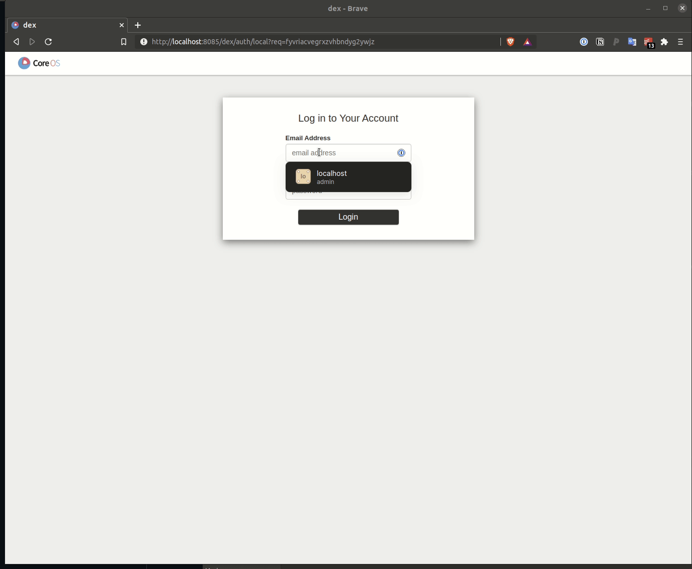

# Kubeflow Installation

There are many [distributions with packaging](https://www.kubeflow.org/docs/distributions/) that exist for deploying Kubeflow into different environment, but here we're going to utilize kustomize and deploy our local installation of Kubeflow using the [project provided manifests](https://github.com/kubeflow/manifests).

We've already downloaded the manifests and made a few local edits required for running Kubeflow on top of microk8s running Kubernetes versions > 1.19. Please follow the instructions below for ensuring a stable environment post installation.

1. Change directories into the `manifests` directory
   ```bash
   $ cd manifests
   ```

2. We will utilize the single command install using the command below
   ```bash
   $ while ! .././kustomize build example | microk8s.kubectl apply -f -; do echo "Retrying to apply resources"; sleep 10; done
   ```

```text
**NOTE** THAT INSTALLATION CAN TAKE UPWARDS OF 10 MINUTES DEPENDING ON THE RESOURCES AVAILABLE ON YOUR WORKSTATION
```

Verify the status of the Kubeflow pods by using the `microk8s.kubectl get pods -A -w` command. The `-w` flag will watch the status of the output of the `get pods -A` command.

```bash
   NAMESPACE                   NAME                                                        READY   STATUS              RESTARTS   AGE
   kube-system                 hostpath-provisioner-5c65fbdb4f-xdhkr                       1/1     Running             1          21m
   kube-system                 metrics-server-8bbfb4bdb-kdrv5                              1/1     Running             1          21m
   kube-system                 kubernetes-dashboard-7ffd448895-qc4dq                       1/1     Running             1          21m
   kube-system                 dashboard-metrics-scraper-6c4568dc68-wp88k                  1/1     Running             1          21m
   kube-system                 calico-node-mhrc6                                           1/1     Running             1          24m
   kube-system                 calico-kube-controllers-847c8c99d-z9xjm                     1/1     Running             1          24m
   kube-system                 coredns-86f78bb79c-mpt62                                    1/1     Running             1          21m
   cert-manager                cert-manager-7dd5854bb4-ch22j                               1/1     Running             0          13m
   auth                        dex-6f4f4fd769-kvh9r                                        1/1     Running             1          13m
   cert-manager                cert-manager-cainjector-64c949654c-xdfbz                    1/1     Running             0          13m
   knative-eventing            mt-broker-controller-5596fd9c9-blh9l                        1/1     Running             0          13m
   cert-manager                cert-manager-webhook-6bdffc7c9d-44pbn                       1/1     Running             0          13m
   istio-system                istiod-755f4cc457-wdzz5                                     1/1     Running             0          13m
   knative-eventing            imc-controller-c8d86c869-h8j4p                              1/1     Running             0          13m
   knative-eventing            eventing-webhook-7497957865-mk8fx                           1/1     Running             0          13m
   knative-eventing            imc-dispatcher-7bf75b8999-j5cjw                             1/1     Running             0          13m
   knative-eventing            eventing-controller-6b4cc547b9-btrjb                        1/1     Running             0          13m
   knative-eventing            mt-broker-ingress-f8b9b6cfc-89zt2                           1/1     Running             0          13m
   knative-eventing            mt-broker-filter-8c699b678-ms87c                            1/1     Running             0          13m
   kubeflow                    admission-webhook-deployment-f5d8f47f8-mh27d                1/1     Running             0          13m
   istio-system                authservice-0                                               1/1     Running             0          13m
   kubeflow                    notebook-controller-deployment-c88b44b79-77vg8              1/1     Running             0          13m
   kubeflow                    metadata-envoy-deployment-95b58bbbb-bdlhz                   1/1     Running             0          13m
   kubeflow                    kubeflow-pipelines-profile-controller-6cfd6bf9bd-5czqm      1/1     Running             0          13m
   kubeflow                    tensorboards-web-app-deployment-59ff4c7bd8-48h4v            1/1     Running             0          13m
   kubeflow                    volumes-web-app-deployment-6457c9bcfc-b8nh6                 1/1     Running             0          13m
   kubeflow                    metacontroller-0                                            1/1     Running             0          13m
   kubeflow                    tf-job-operator-859885c8c4-wgwkb                            1/1     Running             0          13m
   kubeflow                    centraldashboard-5fb844d56d-jkdn9                           1/1     Running             0          13m
   kubeflow                    katib-controller-7b98cd6865-lfpkf                           1/1     Running             0          13m
   istio-system                cluster-local-gateway-7bf6b98855-h2rxx                      1/1     Running             0          13m
   istio-system                istio-ingressgateway-78bc678876-vzwbn                       1/1     Running             0          13m
   kubeflow                    mpi-operator-687bff7b67-hw7c2                               1/1     Running             0          13m
   kubeflow                    mxnet-operator-6cffc568b7-pvxr8                             1/1     Running             0          13m
   kubeflow                    katib-mysql-586f79b694-nrs9p                                1/1     Running             0          13m
   kubeflow                    katib-db-manager-7689947dc5-nnjb8                           1/1     Running             0          13m
   kubeflow                    katib-ui-64fbdf4d94-rmsmd                                   1/1     Running             0          13m
   kubeflow                    jupyter-web-app-deployment-bdfb5d69f-5jzk9                  1/1     Running             0          13m
   kubeflow                    profiles-deployment-5c94fd8fbf-jtdx5                        2/2     Running             0          13m
   kubeflow                    kfserving-controller-manager-0                              2/2     Running             0          13m
   kubeflow                    mysql-f7b9b7dd4-f6hbr                                       2/2     Running             0          13m
   kubeflow                    pytorch-operator-56bffbbd86-ws5s5                           2/2     Running             0          13m
   knative-serving             autoscaler-549ccd665f-mwfvr                                 2/2     Running             1          13m
   knative-serving             activator-7d554f9d67-tmzz5                                  2/2     Running             1          13m
   kubeflow                    workflow-controller-7b44676dff-kbjsd                        2/2     Running             1          13m
   knative-serving             controller-c548cfcff-x955d                                  2/2     Running             1          13m
   kubeflow                    metadata-writer-76b6b98985-ck8gl                            2/2     Running             1          13m
   kubeflow                    minio-5b65df66c9-7mwtn                                      2/2     Running             0          13m
   knative-serving             istio-webhook-68fddcc567-5r558                              2/2     Running             1          13m
   knative-serving             networking-istio-5664b9fb9c-gtwhh                           2/2     Running             1          13m
   kubeflow                    metadata-grpc-deployment-7cb87744c7-wxh4c                   2/2     Running             1          13m
   kubeflow                    ml-pipeline-visualizationserver-7f88f8b84b-zwxfw            2/2     Running             0          13m
   knative-serving             webhook-6644fdc69-hrhz9                                     2/2     Running             1          13m
   kubeflow                    ml-pipeline-persistenceagent-6ff46967ff-57dv8               2/2     Running             0          13m
   kubeflow                    ml-pipeline-scheduledworkflow-66bdf9948d-s47wt              2/2     Running             0          13m
   kubeflow                    ml-pipeline-ui-867664b965-8sqxr                             2/2     Running             0          13m
   kubeflow                    tensorboard-controller-controller-manager-d7c68d6df-2776m   3/3     Running             1          13m
   kubeflow                    xgboost-operator-deployment-c6ddb584-khz6p                  2/2     Running             1          13m
   kubeflow-user-example-com   ml-pipeline-visualizationserver-6ff9f47c6b-rr5kr            2/2     Running             0          9m47s
   kubeflow                    cache-deployer-deployment-6dbb64ddcd-lpcsw                  2/2     Running             1          13m
   kubeflow                    ml-pipeline-viewer-crd-64dddf4597-qrfph                     2/2     Running             1          13m
   kubeflow-user-example-com   ml-pipeline-ui-artifact-767659f9df-9746s                    2/2     Running             0          9m47s
   kubeflow                    ml-pipeline-84858dd97b-q9972                                2/2     Running             1          13m
   kubeflow                    cache-server-f84f6bdcc-qw8gh                                2/2     Running             0          13m

```

 Your output should look similar to what is shown below. `SEE THE NOTE ABOVE`.

One Kubeflow is completed installing we can now configure port forwarding of the `istio-ingressgateway` so we can access the Kubeflow UI on our localhost.

```bash
   microk8s.kubectl port-forward svc/istio-ingressgateway -n istio-system 8085:80
```

Your output should look like the below :

```bash
   Forwarding from 127.0.0.1:8085 -> 8080
   Forwarding from [::1]:8085 -> 8080
```

You can now open a browser and browse to [http://localhost:8085](http://localhost:8085) and you will be prompted to authenticate to proceed to the Kubeflow dashboard. The username and password are below.

**username**: `user@example.com`
**password**: `12341234`

