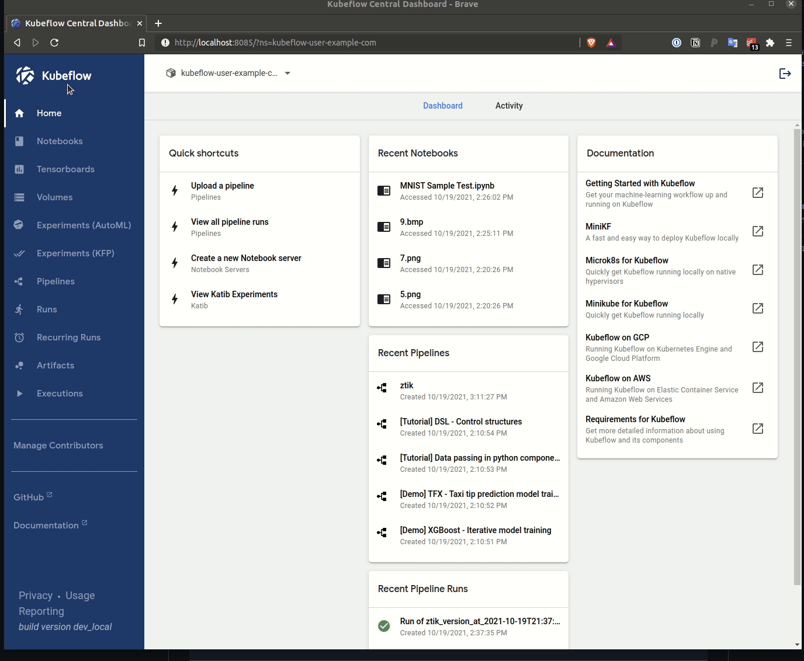
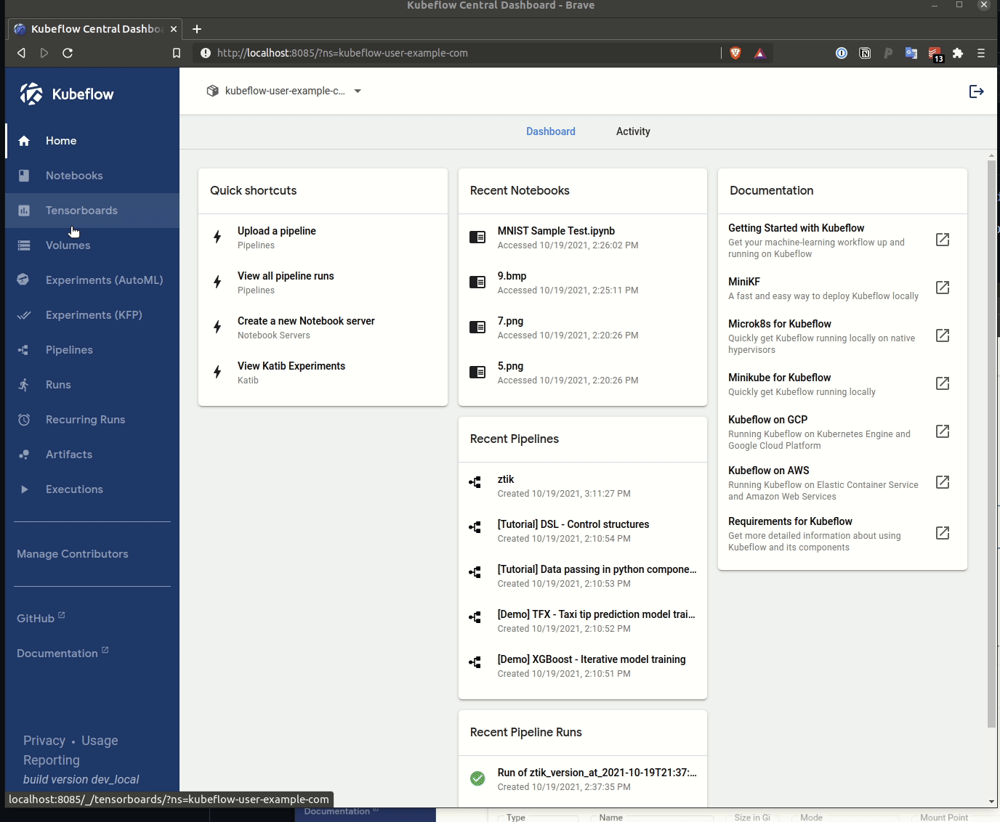

# Creating a Notebook Server in Kubeflow

Once [Kubeflow has been deployed](../kubeflow/README.md) we can create a notebook server for testing the model that has been [trained and deployed](../pipeline/README.md).

The process for creating a notebook is relatively straight forward and the UI provided by the Kubeflow dashboard makes the process painless.

See the gif below for a quick overview of creating a notebook server.

## Upload our Notebook and data

We will need to upload the provided notebook and example images for use in evaluating our model. This is quick and easy using the Jupyter Notebook Server UI as shown below.

