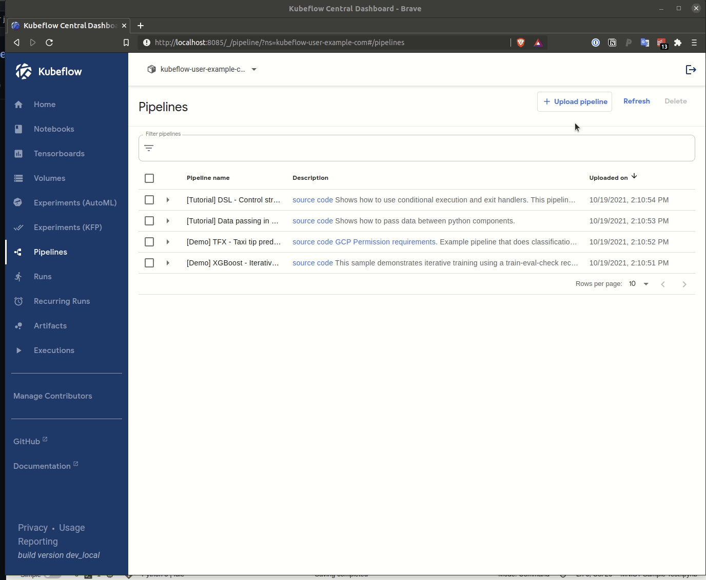

# MNIST Classifier Pipeline

We've provided both the python and generated yaml for deploying the MNIST classifier pipeline for this tutorial contained in the [src](./src) folder of this directory.

## Compiling the pipeline

Though we provide a pre-compiled version of the pipeline in this repository one can also re-compile the pipeline if they want to explore making modifications to the pipeline definition.

Compilation is done through invoking the python interpreter and passing in our pipeline module as shown below

```bash
    python pipeline.py
```

Contained in the `pipeline.py` module are the following calls made to the compiler provided by the Kubeflow Pipleines project.

```python
if __name__ == '__main__':
    import kfp.compiler as compiler
    compiler.Compiler().compile(pipeline, "ztik.yaml")
```

The `compiler.Compiler().compile()` method takes as input our pipeline definition and a name we would like to call the resulting returned `yaml` file containing our K8s ready pipeline definition.

## Uploading the Pipeline

We can upload this pipeline through the Kubeflow UI.



